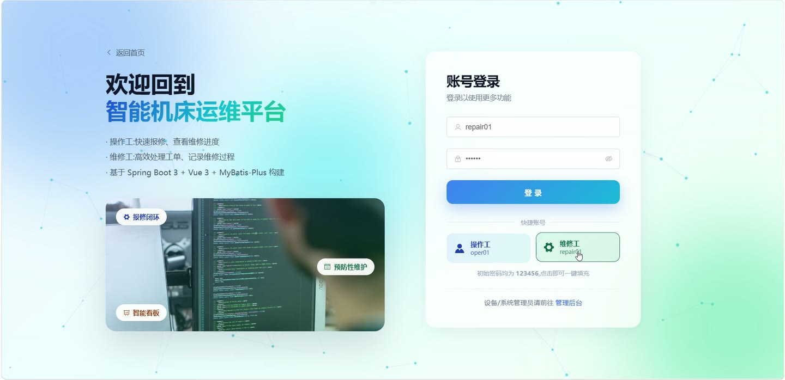
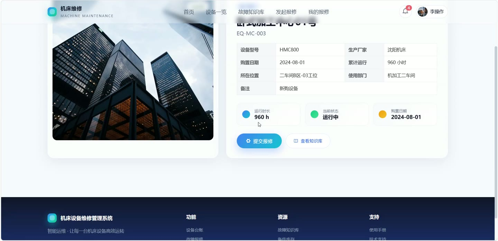
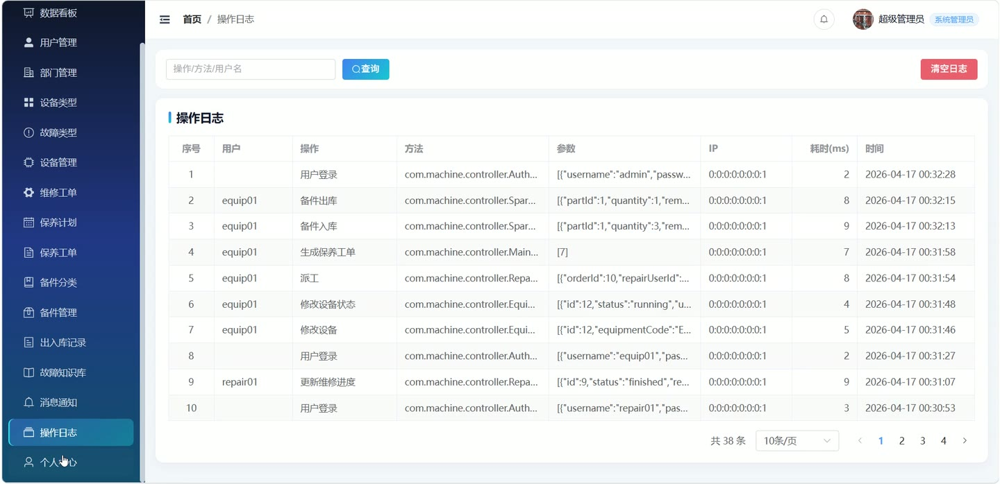
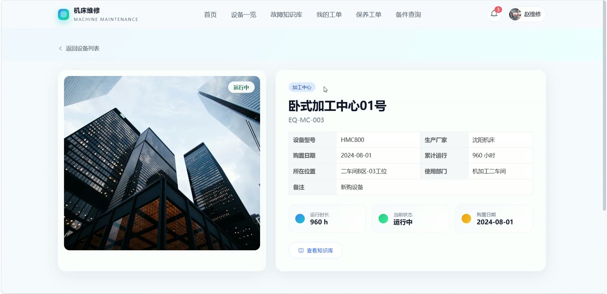

# (附文档)Springboot3+MySQL+Vue3 机床设备维修管理系统

**技术栈**：Springboot3、MySQL

### 系统简介

机床设备维修管理系统是一套基于 Spring Boot 3 + MySQL 的数字化设备运维平台，采用前后端分离架构。系统涵盖设备台账管理、故障报修与维修派工、预防性保养计划、备件出入库管理、故障知识库以及数据看板等核心业务模块，支持操作工、维修工、设备管理员、系统管理员四种角色协同工作，实现设备全生命周期维护管理。
 
### 核心功能
 
### 操作工端

 
- 提交故障报修：填写设备、故障描述、优先级（低/中/高）、故障类型，上传多张故障图片，系统自动生成工单号并通知维修工 
- 查看我的报修列表：按状态（待派工/维修中/已完成/已验收/已驳回）筛选，查看工单进度与维修记录 
- 验收维修工单：对已完成的维修工单进行验收，选择通过或驳回，填写验收备注 
- 查看设备详情：浏览设备基础信息（型号、制造商、购置日期、运行状态、累计运行时长） 
- 查询故障知识库：按关键字、故障类型、设备类型搜索故障现象、原因及解决方案，支持查看详情并自动增加浏览量 
- 查看消息通知：接收工单状态变更、验收结果等系统消息，支持标记已读、一键全部已读、删除消息 
- 管理个人资料：修改真实姓名、手机号、邮箱、头像，修改登录密码 
- 查看首页概览：浏览设备总数、工单数、知识条目数、备件数等统计卡片
 
### 维修工端

 
- 查看我的工单：按工单状态（待处理/维修中/已完成/已验收）筛选，查看分配的维修任务列表 
- 接单操作：从待处理工单中领取维修任务，系统记录接单时间 
- 更新维修进度：填写维修过程描述、故障原因、维修措施，支持分阶段更新进度或标记完成 
- 查看保养工单：查看分配的预防性保养任务列表，按状态（待保养/已完成）筛选 
- 完成保养：填写保养执行记录，系统记录完成时间并更新工单状态 
- 查询备件库存：按关键字、备件分类筛选，查看备件编码、名称、型号、库存量、最低库存预警 
- 备件出库：在维修/保养时领用备件，填写出库数量、关联工单号、备注，系统自动扣减库存并生成出入库记录 
- 查看消息通知：接收派工通知、备件库存预警等消息，支持标记已读、一键全部已读
 
### 设备管理员端

 
- 设备台账管理：新增/编辑/删除设备，填写设备编码、名称、类型、型号、制造商、购置日期、位置、所属部门、运行状态（运行/停机/维修中/报废）、技术文档附件 
- 设备类型管理：维护设备类型字典（类型名称、编码、描述），支持分页搜索 
- 故障报修派工：查看所有待派工维修单，选择维修工进行派工，系统自动发送消息通知维修工 
- 预防性保养计划管理：新增/编辑/删除保养计划，设置计划名称、关联设备、周期类型（天/小时）、周期值、保养内容、启用/停用状态 
- 生成保养工单：根据保养计划手动生成保养工单，系统自动计算下次保养时间 
- 保养工单管理：查看所有保养工单列表，按状态/维修人筛选，查看详情，删除工单 
- 备件管理：新增/编辑/删除备件，设置备件编码、名称、分类、型号、单位、库存量、最低库存预警值、单价、库位 
- 备件入库：填写入库数量、备注，系统自动增加库存并记录入库流水 
- 备件分类管理：维护备件分类字典（分类名称、描述），支持分页搜索 
- 备件出入库记录查询：按备件、出入库类型筛选查看所有流水记录 
- 故障类型管理：维护故障类型字典（类型名称、描述），支持分页搜索 
- 故障知识库管理：新增/编辑/删除知识条目，填写标题、关联故障类型、设备类型、故障现象、原因、解决方案、封面图 
- 部门管理：新增/编辑/删除部门，设置部门名称、编码、负责人、联系电话 
- 查看数据看板：展示设备总数、运行/停机/维修中/报废数量、本月报修数、本月完成数、备件低库存预警列表等统计图表
 
### 管理员端

 
- 用户管理：新增/编辑/删除系统用户，设置用户名、真实姓名、手机号、邮箱、角色（操作工/维修工/设备管理员/系统管理员）、所属部门、启用/禁用状态 
- 重置用户密码：将指定用户密码重置为 123456 
- 查询用户列表：按关键字、角色、状态分页搜索，列表不显示系统管理员自身 
- 维修工下拉列表：获取所有维修工角色用户，用于派工选择 
- 系统日志管理：查看所有操作日志（用户、操作、方法、参数、IP、耗时），支持按关键字/用户名搜索 
- 清空系统日志：一键删除所有日志记录 
- 删除单条日志：按 ID 删除指定日志 
- 文件上传：统一上传接口，支持上传图片/文档，返回可访问的 URL 路径
 
### 技术栈

 后端框架Spring Boot 3.x ORMMyBatis-Plus 3.5.x 权限认证JWT（自定义拦截器 + 注解） 前端框架Vue 3 + Element Plus 状态管理Pinia 构建工具Vite 数据库MySQL 8.x 工具库Hutool、Lombok、Jackson
 
### 交付内容

 
- 后端完整源码 
- 前端完整源码 
- 数据库初始化脚本 
- 万字文档

## 界面展示

---

## 获取完整源码 + 万字文档

本仓库为项目介绍页。**完整前后端源码、数据库初始化脚本、万字项目文档**，请加微信 `kangkangcode`，或访问 [codekk.top](http://codekk.top) 获取。

可作课程设计 / 毕业设计参考，支持远程部署调试。